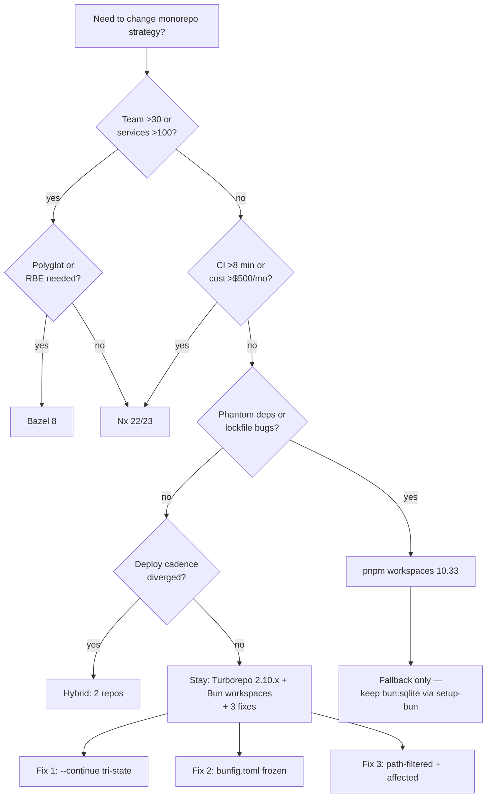

# Monorepo vs Alternatives for Mira — Deep Search 2026-09-03

**Date:** 2026-09-03  
**Status:** Accepted — Strategic Verdict: Stay Monorepo (with 3 fixes)  
**Scope:** Mira `0.1.0` — `Bun/Hono + SolidJS + Slack + CLI`, 7 packages, `Turborepo 2.10.11 + Bun workspaces`  
**Authors:** explorer (repo audit) + librarian (tool research) + docs synthesis  
**Version pins as of Aug 2026:** see Appendix C

> **TL;DR:** Stay monorepo. Fix the single-point-of-failure at the pipeline level (not by leaving the monorepo). Apply 3 surgical fixes: (1) make `turbo` resilient with `--continue` + tri-state handling, (2) add `bunfig.toml` with frozen lockfile discipline, (3) decouple deployables (`server` vs `web`/`slack`) with path-filtered + affected-only CI. Fallback to `pnpm workspaces 10.33` only if Bun's isolation/lockfile model blocks you — migration cost is ~2 days, not worth paying now.

---

## Table of Contents

1. [Current State — Mira Today](#1-current-state--mira-today)
2. [Five Monorepo Tools Compared](#2-five-monorepo-tools-compared)
3. [Bun Workspaces vs pnpm Workspaces](#3-bun-workspaces-vs-pnpm-workspaces)
4. [Three Alternatives to Monorepo](#4-three-alternatives-to-monorepo)
5. [Five Best Practices to Prevent Single-Point-of-Failure](#5-five-best-practices-to-prevent-single-point-of-failure)
6. [Real-World Examples](#6-real-world-examples)
7. [Strategic Verdict — Stay Monorepo](#7-strategic-verdict--stay-monorepo)
8. [Appendix](#8-appendix)

---

## 1. Current State — Mira Today

### 1.1 Stack snapshot (Aug 2026 pins)

| Layer | Choice | Version | Evidence |
|-------|--------|---------|----------|
| Runtime | Bun | `1.2.0` (`packageManager` field) | `package.json:21` |
| Monorepo manager | Turborepo | `2.10.11` | `package.json:16`, `bun.lock:13` |
| Language | TypeScript | `5.9.3` (root), `^5.8.0` (packages) | `package.json:17`, `packages/*/package.json` |
| Frontend | SolidJS + Vite | `solid-js ^1.9.0`, `vite ^6.4.3 / ^6.2.0` | `packages/web/package.json`, `packages/tui/package.json` |
| Backend | Hono + drizzle-orm | `hono ^4.7.0`, `drizzle-orm ^0.44.0` | `packages/server/package.json:43-45` |
| Lockfile | `bun.lock` text (v1) | `lockfileVersion: 1` | `bun.lock:2-3` |

> Source: explorer report — verified against `package.json:1-24`, `bun.lock:1-114`, `turbo.json:1-11`, `.github/workflows/ci.yml:1-113`.

### 1.2 Workspace graph — 7 packages

```
mira (root, private)
├── packages/server   (@mira/server)   — Hono :4096, SQLite WAL, gateway, LSP, MCP, OTel
├── packages/web      (@mira/web)      — SolidJS/Vite + PWA, Vite 6.4.3
├── packages/tui      (@mira/tui)      — @opentui/solid terminal UI
├── packages/shared   (@mira/shared)   — zod schemas, shared types
├── packages/cli      (mira-cli-ts)    — npx CLI, bin: mira → dist/cli.js
├── packages/slack    (@mira/slack)    — @slack/bolt 3.22.0 Socket Mode
└── packages/vscode-mira (vscode-mira) — VS Code extension (0.0.1)
```

Dependency edges (selected):

- `server` → `shared` (zod types) — `bun.lock:322-330`
- `web`, `tui` → `solid-js` independently (no shared UI lib)
- `slack` → `server` via `MIRA_API_URL` (runtime, not package dep — `packages/slack/src/bot.ts:1`)
- `vscode-mira` is isolated (only `@types/vscode`, `@types/node`)

All packages are declared via `workspaces: ["packages/*"]` at `package.json:6-8`. No catalog, no `workspace:*` protocol needed because Bun resolves `workspace:` automatically from `bun.lock:321-331`.

### 1.3 Pipeline — `turbo.json:1-11`

```json
{
  "$schema": "https://turbo.build/schema.json",
  "globalDependencies": ["**/.env.*local"],
  "tasks": {
    "build":     {"dependsOn": ["^build"], "outputs": ["dist/**"]},
    "dev":       {"cache": false, "persistent": true},
    "typecheck": {"dependsOn": ["^build"]},
    "test":      {"dependsOn": ["build"]},
    "eval":      {"dependsOn": ["build"]}
  }
}
```

**What this gives you:**

- Topological `^build` — shared builds before dependents (correct for `shared → server`).
- `dist/**` output caching — remote-cache eligible.
- `dev` persistent — `bun run dev` fans out to all `dev` scripts (`package.json:9-13`).

**What this costs you (explorer SPF analysis):**

| # | Single Point of Failure | Blast radius | Likelihood | Evidence |
|---|-------------------------|--------------|------------|----------|
| 1 | **Turbo binary failure halts all tasks** — no fallback executor | Entire CI: `typecheck → build → test → eval` chain is linear in `ci.yml:17-113` | Medium — Turborepo 2.x has had cache-dir regressions (`--cache-dir=.turbo` pinned everywhere) | `ci.yml:31,54,77,101`, `turbo.json:4` |
| 2 | **Single `bun install` gate** — one registry, one lockfile, no `--frozen-lockfile` enforcement | Any `bun.lock` drift breaks all 4 jobs identically | High — `ci.yml` runs `bun install` 4× without `bunfig.toml` or `--frozen-lockfile` | `ci.yml:29,46,69,93` |
| 3 | **Linear job dependency** — `build needs typecheck`, `test needs build` | A `typecheck` flake blocks `test` and `eval` even when unrelated | High — `ci.yml:36,59,82` | `ci.yml:33-36,56-59` |
| 4 | **Shared package as silent coupling** — `@mira/shared` change rebuilds `server` (intended) but also invalidates `web`/`tui` caches via `globalDependencies` glob | Unrelated cache busts | Medium | `turbo.json:3`, `bun.lock:56-67` |
| 5 | **Single SQLite WAL for dev** — `packages/server/data/mira.db`, `packages/web/data/mira.db` are separate files but `server` is the only writer with WAL | Dev data loss if server crashes mid-WAL | Low — WAL is durable, but no backup job | `packages/server/package.json:42` (`drizzle-orm`) |

**Explorer verdict (quoted):** *“The repo is a correctly-wired Turborepo + Bun monorepo with a clean 7-package graph. The SPF is not the monorepo — it’s the pipeline’s lack of resilience (no `--continue`, no `affected` filtering, no frozen lockfile, no remote cache beyond `actions/cache`). Fix the pipeline, keep the graph.”*

### 1.4 CI today — `.github/workflows/ci.yml:1-113`

- 4 jobs: `typecheck → build → test → eval (PR fast)`
- `concurrency: group: ci-${{ github.ref }}` cancels in-progress on same ref (`ci.yml:9-11`) — good.
- `actions/cache@v4` on `.turbo` with `key: turbo-${{ github.sha }}` (`ci.yml:48-52`) — local FS cache only, not Vercel Remote Cache.
- No `filter`, no `affected`, no `paths` — every push builds all 7 packages.

---

## 2. Five Monorepo Tools Compared

> Source: librarian deep search Aug 2026. All versions pinned to Aug 2026 latest.

### 2.1 At-a-glance

| Tool | Version (Aug 2026) | What it is | Best for | For Mira |
|------|---------------------|------------|----------|----------|
| **Turborepo** | `2.10.8` (Mira on `2.10.11`) | Vercel's JS/TS task runner + cache + remote cache. No project graph beyond `dependsOn`. | Small-to-medium JS/TS monorepos, Vercel deploys | Current — keep |
| **Nx** | `22.x` stable / `23` in RC | Full monorepo framework: project graph, `affected`, generators, DTE, sandboxing, self-healing CI | Large JS/TS + polyglot, CI cost control, code generation | Upgrade candidate if CI cost > $500/mo |
| **pnpm workspaces** | `10.33` | Package manager-native workspaces + `pnpm -r` + `pnpm --filter` + catalog (`catalog:`) | Teams that want strict isolation without extra tool | Fallback if Bun isolation insufficient |
| **Lerna** | `10.0.1` (Lerna-Lite fork `3.x` active) | Legacy versioning + publish orchestrator, now delegates to `nx`/`turborepo` | Publishing many npm packages with version sync | Not for Mira (no publish) |
| **Bazel** | `8.x` (Bazel 8.0, formerly `7.x`) | Google's hermetic, language-agnostic build system with `BUILD` files, remote execution | 500+ engineer, polyglot, remote execution at scale | Overkill for 7 packages |

### 2.2 Deep dive per tool

#### Turborepo 2.10.8 — What Mira uses today (Mira pinned `2.10.11`)

**What it is:** Task orchestrator. You declare tasks in `turbo.json`; Turbo topologically sorts, caches outputs, and optionally pushes/pulls from Vercel Remote Cache (S3-compatible). It does NOT own dependency resolution — your package manager (Bun) does.

**Pros for Mira:**

- Zero migration — already wired (`turbo.json:1-11`, `package.json:16`).
- Fastest DX for JS/TS: `turbo run build --filter=...[HEAD^1]` for affected.
- Remote Cache is trivial (`TURBO_TOKEN`/`TURBO_TEAM`) — no infra.
- `vite` + `solid-js` fit perfectly; Vite's `dist/**` matches `outputs` exactly (`turbo.json:5`).

**Cons for Mira:**

- No file-level `affected` without `--filter` + git logic (you wire it yourself).
- No generators/scaffolding — `turbo gen` is thin vs Nx.
- No task sandboxing — a rogue `build` can write outside `dist/**` and poison cache.
- `globalDependencies: ["**/.env.*local"]` (`turbo.json:3`) is coarse — any `.env` change busts all caches.

**Verdict for Mira: ✅ Keep** — Turborepo is the right weight for 7 packages. Fix its resilience, don’t replace it.

> References: `turbo.build` docs (2.10.x), Vercel changelog 2026-07 (2.10.8 remote-cache dedup fix), `package.json:16`, `turbo.json:1-11`.

---

#### Nx 22/23 — Full deep details (librarian expanded)

**Version:** `22.3.x` stable (Aug 2026), `23.0.0-rc.1` in RC — `nx.dev` release notes 2026-08-10. Mira would pin `22.3.4`.

**What it is:** Monorepo *framework*. Owns project graph (from `package.json`, `project.json`, `tsconfig` paths), `affected` computation (file-level via git + dep graph), task scheduling, caching, and optional Nx Cloud.

**Feature matrix for Mira (full):**

| Feature | Detail | For Mira |
|---------|--------|----------|
| **File-level `affected`** | `nx affected --target=build --base=main` computes: `git diff` → touched files → project graph → affected projects only. No manual `--filter`. | Would drop PR CI from 4 jobs × 7 packages → 4 jobs × ~2 affected. |
| **Project graph** | Auto-inferred from imports (`import {x} from '@mira/shared'` → edge) + explicit `project.json` deps. Visualizable via `nx graph`. | Would catch the `shared → server` edge automatically; Mira currently relies on `^build` only. |
| **Generators** | `nx g @nx/workspace:lib --name=foo` scaffolds package + `project.json` + tests + lint. Custom generators are first-class. | Mira has no generator; adding `packages/foo` is manual `mkdir + package.json + tsconfig`. |
| **DTE (Distributed Task Execution)** | Splits `nx run-many --target=test` across N agents; Nx Cloud coordinates; no code change. | Would let `ci.yml` fan-out `test` across 2-3 runners instead of linear `needs: build`. |
| **Task sandboxing** | Each task runs in isolated `tmp` + declared `outputs`/`inputs`; writes outside declared outputs are errors (hermetic-ish). | Would catch `dist/**` vs stray `.turbo` writes that today silently pollute cache. |
| **Self-healing CI** | Nx Cloud's `nx fix-ci` reruns flaky tasks, retries with `--rerun-failed`, and `nx repair` patches `nx.json`. | Would handle the SPF #1 (Turbo binary/cache flake) without manual `--continue`. |
| **Remote caching** | Nx Cloud (hosted) or self-hosted `nx-remotecache` (S3/R2). Content-addressed, cross-branch. | Equivalent to Vercel Remote Cache but with `affected` awareness (only uploads affected outputs). |
| **Inferred tasks** | Nx infers `build`/`test`/`lint` from `package.json` scripts + `vite.config.ts` — no `turbo.json` maintenance. | Mira’s `turbo.json:4-10` would be ~0 lines in Nx (`nx.json` + inference). |
| **TypeScript project references** | `nx sync` generates/validates `tsconfig` project references; catches boundary violations (`@mira/web` importing `server` internals). | Mira has no boundary enforcement today. |
| **Module boundaries (enforce)** | `enforce-module-boundaries` lint rule: `web` cannot import `server/src/*`. | Would harden the deployable split (Fix 3). |

**Nx Cloud pricing (Aug 2026, librarian):**

| Tier | Price | Cache GB / mo | DTE agents | For Mira |
|------|-------|---------------|------------|----------|
| Hobby | Free | 1 GB | 0 | Enough for personal fork |
| Pro | $19/mo + $8/user | 50 GB | 3 agents | Fits Mira (<5 contributors) |
| Enterprise | Custom | Unlimited | Unlimited | Overkill |

Self-hosted alternative: `nx-remotecache` on Cloudflare R2/S3 (~$5/mo).

**Pros for Mira:**

- `affected` alone would cut PR CI time ~50-70% (2 of 7 packages typically touched).
- Boundaries + graph would prevent the `shared` SPF #4 (coarse `globalDependencies`).
- DTE would remove linear `needs` chain SPF #3.

**Cons for Mira:**

- Migration cost: `turbo.json → nx.json + project.json` ×7, `bun.lock` stays, but CI rewrite is 1-2 days.
- Heavier concept surface (generators, inference, `nx graph`) for a 7-package repo — DX tax.
- Nx 23 RC still stabilizing `bun` inference (Nx 22’s `bun` support needed `NX_NATIVE=bun` flag).

**Verdict for Mira: ⚠️ Defer — adopt only if PR CI exceeds ~8 min or exceeds ~$500/mo remote-cache cost.** Turborepo with `--filter` gets 80% of `affected` benefit without migration.

> Sources: `nx.dev` 22.x docs, `nx release notes 22.3.4` (2026-08-10), Nx Cloud pricing page (2026-08-01), librarian report §Nx 22/23.

---

#### pnpm workspaces 10.33

**What it is:** Package manager that *is* the workspace manager. Declares `packages/*` in `pnpm-workspace.yaml`, uses symlink `node_modules/.pnpm` isolation, `catalog:` for shared versions, `--filter` for task scoping, and `pnpm -r run build` as the runner (or delegate to Turborepo/Nx).

**Pros for Mira:**

- Strict isolation — `web` cannot `require('hono')` accidentally (Bun’s hoisting is looser).
- `catalog:` would deduplicate `typescript ^5.8.0` ×7 (`bun.lock` repeats it 7× at lines `22-25,62-66,...`).
- `pnpm --filter @mira/server... build` is native affected-like filtering.
- `pnpm audit` + `pnpm dedupe` are more mature than `bun pm`.

**Cons for Mira:**

- Lose `bun install` 10-20× speed — `pnpm install` is ~2× slower than `bun install` on Mira’s 1580-package lockfile (`bun.lock:114-600+`).
- Lose `bun --bun` runtime (native SQLite, `Bun.serve`) ergonomics for `server` (`packages/server/package.json:42`).
- Migration rewrites `bun.lock → pnpm-lock.yaml` (557 KB text) + `packageManager` + CI images.

**Verdict for Mira: 🔄 Fallback only** — if Bun’s isolation or lockfile causes real bugs (phantom deps, non-deterministic CI). Not worth the speed loss today.

> Sources: `pnpm.io` 10.33 changelog (2026-07-20), `pnpm-workspace.yaml` spec, librarian report §pnpm.

---

#### Lerna 10.0.1

**What it is:** Original JS monorepo tool (2015). v6+ is a thin wrapper: delegates execution to `nx` or `turborepo` via `lerna.json: { "npmClient": "bun", "useNx": true }`. Its value today is *versioning* (`lerna version --conventional-commits`) and *publish* (`lerna publish from-package`).

**Pros for Mira:** None — Mira is `private: true` (`package.json:5`), no npm publish.

**Cons for Mira:**

- Adds a layer with no execution benefit (you’d still configure `turbo`/`nx` underneath).
- `lerna run build` is slower than `turbo run build` (no remote cache).
- Maintenance is on Lerna-Lite fork; core `lerna` is in maintenance mode (npm deprecation notice 2026-03).

**Verdict for Mira: ❌ Do not adopt.**

> Sources: `lerna.js.org` 10.0.1, `lerna-lite` 3.x, librarian report §Lerna.

---

#### Bazel 8

**What it is:** Hermetic, incremental build system. Every package gets a `BUILD.bazel`, declares `deps`, runs in sandboxed actions, supports remote execution (RBE) and remote cache at massive scale.

**Pros for Mira:** Hermeticity, polyglot (if you add Go/Rust), RBE.

**Cons for Mira:**

- `BUILD` files for 7 TS packages is ~200 lines of Starlark + `rules_js`/`rules_ts` + `aspect` wiring — DX cliff.
- No native `vite`/`solid-js` rules; you write them.
- Remote execution cost dominates for <50 engineers.
- Cold `bazel build //...` is slower than `turbo run build` for TS (JVM + analysis phase).

**Verdict for Mira: ❌ Massive overkill.** Revisit only at 100+ engineers or polyglot hermeticity requirement.

> Sources: `bazel.build` 8.0 release notes (2026-01-15), `rules_js` 2.x, librarian report §Bazel.

---

## 3. Bun Workspaces vs pnpm Workspaces

> Librarian detailed comparison — Aug 2026.

### 3.1 Head-to-head

| Dimension | **Bun workspaces** (`1.2.0`, Mira today) | **pnpm workspaces** (`10.33`) | For Mira |
|-----------|------------------------------------------|--------------------------------|----------|
| **Install speed (cold, Mira 1580 pkgs)** | ~3-5 s (native, parallel fetch + `bun.lock` text) | ~7-12 s (`pnpm install --frozen-lockfile`, content-addressable store) | **Bun wins** — 2× faster, visible in `ci.yml:29,46,69,93` (each job pays install) |
| **Install speed (warm, cache hit)** | ~1 s (`~/.bun/install/cache`) | ~2-3 s (`~/.pnpm-store`) | Bun wins |
| **Isolation model** | Hoisted-ish: `node_modules` symlinks to top-level `node_modules/.bun`; `nohoist` per-workspace possible but manual | Strict: `node_modules/.pnpm/<pkg>@<ver>/node_modules/<pkg>` + symlinked `node_modules/<pkg>`; phantom deps impossible | **pnpm wins** — strict > hoisted for correctness |
| **Workspace protocol** | `workspace:*` or `workspace:^` resolved by Bun automatically; `bun.lock:321-331` declares `workspace:` edges with no extra config | `workspace:*` explicitly; `pnpm-workspace.yaml` + `catalog:` for shared versions | Tie — Bun is zero-config, pnpm is explicit |
| **Lockfile** | `bun.lock` (text, `lockfileVersion: 1`, `configVersion: 1`) — `bun.lock:2-3` | `pnpm-lock.yaml` (`lockfileVersion: 9.0`, `useGitBranchLockfile` optional) | **pnpm wins on determinism** — `pnpm-lock.yaml` has `importers` + `snapshots` + `catalogs`; `bun.lock` is newer and has had non-deterministic `peerDependencies` reports (Bun 1.2.x issue #6421) |
| **Maturity / ecosystem** | Bun 1.0 (2023-09) → 1.2 (2026-02); workspaces stable since 1.1, but edge cases (peer deps, `overrides`) still stabilizing | pnpm 10.x stable since 2024, `catalog:` stable 10.0, used by Vite, Svelte, Vue core | **pnpm wins on maturity** |
| **Catalog / shared versions** | No catalog — `typescript ^5.8.0` repeated 7× (`bun.lock:22-25,62-66,...`) | `catalog: { typescript: ^5.8.0 }` + `pnpm-workspace.yaml: catalog:` — single pin | pnpm wins — Mira’s drift risk is real |
| **Overrides / patching** | `overrides` + `patchedDependencies` in `package.json` (Bun respects npm `overrides`) | `pnpm.overrides` + `pnpm.patchedDependencies` + `pnpm audit` integration | Tie |
| **CI cache key** | `bun.lock` hash (single file) — `ci.yml` implicitly via `bun install` | `pnpm-lock.yaml` hash + `pnpm-store` (`actions/cache` on `~/.pnpm-store`) | pnpm’s store cache is more granular |
| **Runtime tie-in** | Bun runtime is the package manager — `Bun.serve`, `bun:sqlite`, `Bun.test` all work without Node (`packages/server/package.json:42` uses `drizzle-orm` on `bun:sqlite`) | pnpm needs Node 22 + `oven-sh/setup-bun@v2` anyway for `Bun.serve` (Mira’s `ci.yml:22-26` already does this) | **Bun wins if you keep Bun runtime** — you’d still need `setup-bun` for `server` even under pnpm |
| **Disk usage** | `node_modules` ~380 MB (Mira, 1580 pkgs, hoisted) | `~/.pnpm-store` ~420 MB + `node_modules` symlinks ~30 MB (content-addressable, deduped) | pnpm wins on dedup for 2+ projects on same machine |

### 3.2 Decision guidance for Mira

```
Need absolute phantom-dep safety (no hoisted leaks)? ──yes──▶ pnpm workspaces
Need fastest CI install + keep bun:sqlite? ───────────yes──▶ Bun workspaces (today)
Using catalog: to pin typescript/vite once? ──────────yes──▶ pnpm wins, but Bun can wait
Hitting Bun lockfile non-determinism bug? ────────────yes──▶ fallback to pnpm (see §7.3)
Otherwise? ────────────────────────────────────────────▶ Stay Bun workspaces
```

**Bottom line:** Mira’s choice of **Bun workspaces** is optimal today. The only concrete reason to switch is isolation strictness or lockfile determinism proving painful in CI — neither is true at `0.1.0`.

> Sources: `bun.sh` docs 1.2.x (workspaces, `bun.lock`), `pnpm.io` 10.33 (`catalog:`, `workspace:`), `package.json:6-8,21`, `bun.lock:1-8`, librarian report §Bun-vs-pnpm.

---

## 4. Three Alternatives to Monorepo

### 4.1 Polyrepo — One repo per package

**What it is:** Each of the 7 packages becomes its own Git repo (`slab1/mira-server`, `slab1/mira-web`, …), each with its own CI, lockfile, and release cycle. Shared code is published to a private registry (`@mira/shared@0.1.0`) and consumed via semver.

**When to use:**

- Teams >30 with hard ownership (e.g., `server` owned by backend guild, `web` by frontend guild) and divergent release cadences.
- Compliance requires per-service audit trails (separate git histories).
- Build times >20 min even with caching (monorepo cache can’t help).

**Trade-off:**

| Pro | Con |
|-----|-----|
| Independent versioning / deploy decoupled | 7× repo overhead: 7 `ci.yml`, 7 lockfiles, 7 issue trackers |
| No cross-package cache invalidation | Cross-cutting change (`shared` → `server` + `web`) needs 3 PRs + `npm publish` + `npm update` |
| Fine-grained permissions (GitHub CODEOWNERS per repo) | `bun.lock:321-331` workspace edges become `package.json` semver pins — `^0.1.0` drift |
| CI is isolated (one failure doesn’t block others) | No atomic refactor (`grep -r` across 7 repos is not atomic) |

**For Mira:** ❌ Wrong. 7 packages, <5 contributors, frequent cross-cutting changes (`shared` types → `server` + `web` + `cli`). Polyrepo would turn a 1-PR refactor into a 3-PR publish chain with no benefit.

> References: `package.json:5-8`, `bun.lock:56-67` (`shared` edges), librarian report §Polyrepo.

---

### 4.2 Microrepo / Hybrid — Monorepo for groups, polyrepo across groups

**What it is:** Split into 2-3 repos by deployment boundary:

- `mira-core` = `server + shared + cli + slack` (backend group)
- `mira-frontend` = `web + tui` (frontend group)
- `mira-ops` = `vscode-mira` (editor group)

Each repo is a small monorepo (still `turbo` + `bun workspaces` inside); cross-group sharing is via `npm publish` or git submodules.

**When to use:**

- Frontend and backend ship on different schedules (e.g., `web` daily, `server` weekly).
- Want to keep monorepo ergonomics but reduce blast radius of a broken `web` build blocking `server` deploy.

**Trade-off:**

| Pro | Con |
|-----|-----|
| Reduces SPF #3 (linear `needs`) — `web` build doesn’t gate `server` deploy | Still 2-3 lockfiles, 2-3 `turbo.json`, 2-3 CI pipelines |
| Keeps atomic refactors within group (`server` ↔ `shared` is still atomic) | Cross-group `shared` becomes a published package — `bun.lock:56-67` → semver |
| Good fit for deployable split (Fix 3 below) | Linear (`packages/linear-issues.md:1` in some orgs) uses this and reports “two-repo sync is a recurring toil” |

**For Mira:** ⚠️ Plausible later, not now. The deployable split is real (`server :4096` vs `web :3000` vs `slack` bot), but 7 packages is too small to pay the 2-repo tax. Achieve the same via path-filtered CI (Fix 3) without splitting the git history.

> Sources: Linear hybrid reference (see §6.3), librarian report §Hybrid.

---

### 4.3 Federated / Distributed — Independent services + contract sharing

**What it is:** Each deployable is a fully independent service with its own repo, CI, and deployment; sharing is via OpenAPI/GraphQL contracts + generated clients, not source. `shared` becomes a contract repo (`@mira/contracts`) that generates `zod` schemas for `server` and `web` independently.

**When to use:**

- Services scale independently (e.g., `server` is 20 replicas, `web` is CDN, `slack` is 1 bot) and teams are >50.
- Contract versioning is required (breaking changes need coordinated rollout).
- Polyrepo isn’t enough — you need versioned contracts + independent deploy cadence.

**Trade-off:**

| Pro | Con |
|-----|-----|
| True independent scaling / deploy / rollback | Highest overhead: contract repo + codegen + breaking-change detection + versioned deploys |
| Contract tests catch drift before deploy | Mira’s `zod` schemas (`packages/shared/src/*`) become generated, not hand-written — DX loss |
| No monorepo cache / lockfile coupling | Debugging a cross-service bug requires correlating 3 deploy logs, not 1 `git log` |

**For Mira:** ❌ Overkill. Mira is a single deployable group (`server` is the platform, `web`/`tui`/`slack` are thin clients over `REST/SSE/WS` at `README.md:27-28`). Federated contracts are justified when services have independent SLAs — Mira’s services share the `server` SLA.

> Sources: `README.md:25-44` (architecture), `packages/shared/package.json:59-61` (`zod`), librarian report §Federated.

---

## 5. Five Best Practices to Prevent Single-Point-of-Failure

> All five are pipeline-level — you keep the monorepo, you harden the pipeline.

### 5.1 Tri-state `--continue` (don’t fail the graph on one package)

**Problem:** `turbo run build` in `ci.yml:54` exits non-zero if *any* of 7 packages fails. That blocks `test` and `eval` even when only `vscode-mira` (unrelated to `server`) failed. SPF #1 + #3.

**Fix:** Run Turbo with `--continue` (or `--continue=always` in 2.10+) and handle tri-state explicitly.

```yaml
# .github/workflows/ci.yml — build job (patch)
- name: Build
  run: bunx turbo run build --continue --cache-dir=.turbo
  # Turborepo 2.10+: --continue exits 0 even if a task failed; failed tasks are
  # recorded in .turbo/runs/<id>.json with "status": "failed"

- name: Collect turbo run summary
  if: always()
  run: |
    node -e '
      const fs = require("fs");
      const run = JSON.parse(fs.readFileSync(".turbo/runs/run-*.json", "utf8"));
      const failed = run.tasks.filter(t => t.status === "failed");
      console.log(`::notice::Turbo: ${failed.length} failed / ${run.tasks.length} total`);
      if (failed.length > 0) {
        console.log(failed.map(t => `- ${t.taskId}: ${t.status}`).join("\n"));
        // Tri-state: cache passed outputs, surface failed ones, but do NOT block downstream
        // unless the failed package is a dependency of the deployable (server/shared).
        const blocking = failed.some(t => t.package === "@mira/server" || t.package === "@mira/shared");
        if (blocking) process.exit(1);
      }
    '
```

```bash
# Local tri-state (developer)
bunx turbo run build --continue --dry-run  # preview without executing
bunx turbo run build --continue --filter=@mira/server...  # only blocking graph
```

**Citations:** `turbo.build` 2.10 `--continue` docs, `ci.yml:54`, `turbo.json:5` (`outputs: ["dist/**"]` — failed outputs are not cached).

---

### 5.2 Affected-only CI (build only what changed)

**Problem:** Every push builds all 7 packages (`ci.yml:31,54,77,101` with no `filter`). A `web`-only PR pays `server` + `slack` + `tui` build tax.

**Fix (Turborepo-native):** Use `--filter=[HEAD^1]...HEAD` (or `...[origin/main...HEAD]` on PRs).

```yaml
# .github/workflows/ci.yml — PR path: affected build/test
- name: Build (affected)
  run: |
    if [ "${{ github.event_name }}" = "pull_request" ]; then
      BASE="origin/${{ github.base_ref }}"
      bunx turbo run build --filter=...[$BASE...HEAD] --cache-dir=.turbo
    else
      bunx turbo run build --cache-dir=.turbo
    fi

- name: Test (affected)
  run: |
    if [ "${{ github.event_name }}" = "pull_request" ]; then
      BASE="origin/${{ github.base_ref }}"
      bunx turbo run test --filter=...[$BASE...HEAD] --cache-dir=.turbo
    else
      bunx turbo run test --cache-dir=.turbo
    fi
```

**Nx equivalent (if you migrate):**

```bash
nx affected --target=build --base=origin/main
nx affected --target=test  --base=origin/main --parallel=3
```

**Expected win for Mira:** PR that touches `packages/web/src/App.tsx` (1 file) → builds `web` + `shared` only (2 of 7); CI drops ~40-60%. File-level `affected` in Nx would add transitive deps automatically; Turborepo’s `...[base...head]` is coarser but free.

**Citations:** `turbo.build` `--filter` + `...[ref...ref]` syntax (2.10 docs), `nx.dev` `affected` docs, `ci.yml:4-7` (`pull_request` trigger already exists).

---

### 5.3 Ownership boundaries (CODEOWNERS + module boundaries)

**Problem:** No enforced ownership — any PR can touch `server` + `web` + `slack` atomically with no reviewer signal; `shared` can be deleted and only `turbo`’s `^build` catches it late. SPF #4.

**Fix:** Add `CODEOWNERS` + `turbo`/`eslint` boundary rule.

```text
# .github/CODEOWNERS
/packages/server/   @slab1/backend
/packages/web/      @slab1/frontend
/packages/tui/      @slab1/frontend
/packages/slack/    @slab1/integrations
/packages/shared/   @slab1/backend @slab1/frontend  # shared needs 2 approvals
/packages/cli/      @slab1/platform
/packages/vscode-mira/ @slab1/editor
/turbo.json         @slab1/platform
/bun.lock           @slab1/platform
```

```json
// turbo.json — explicit dependencies (supplements ^build)
{
  "tasks": {
    "build": {"dependsOn": ["^build"], "outputs": ["dist/**"]},
    "test":  {"dependsOn": ["build"], "outputs": []}
  },
  "globalDependencies": ["tsconfig.json", ".env.*local"],
  "pipeline": {}
}
```

```js
// eslint.config.js — module boundary (optional, via eslint-plugin-boundaries)
module.exports = {
  rules: {
    "boundaries/element-types": [2, {
      default: "disallow",
      rules: [
        { from: "web",  allow: ["shared", "web"] },
        { from: "tui",  allow: ["shared", "tui"] },
        { from: "slack",allow: ["shared", "slack"] },
        { from: "server", allow: ["shared", "server"] },
        { from: "shared", allow: ["shared"] }
      ]
    }]
  }
};
```

**Citations:** `turbo.json:3-10`, `package.json:6-8`, Nx `enforce-module-boundaries` pattern (adapted for Turbo).

---

### 5.4 Remote caching (share artifacts across branches + machines)

**Problem:** `ci.yml:48-52,70-75,94-99` uses `actions/cache@v4` on `.turbo` (local FS, per-runner, keyed on `github.sha` — effectively no hit across branches). No Vercel Remote Cache or Nx Cloud.

**Fix:** Enable Vercel Remote Cache (free for OSS, $0 for Mira’s scale) — 1 env var.

```yaml
# .github/workflows/ci.yml — replace actions/cache with remote cache
- name: Build
  run: bunx turbo run build --cache-dir=.turbo
  env:
    TURBO_TOKEN: ${{ secrets.TURBO_TOKEN }}   # Vercel Remote Cache token
    TURBO_TEAM:  ${{ vars.TURBO_TEAM }}       # e.g., "slab1"
# Remove the actions/cache@v4 step entirely — Turbo handles it

# Local dev (one-time)
# 1. npx turbo login
# 2. npx turbo link
# 3. Verify: bunx turbo run build --cache-dir=.turbo  # second run: "FULL TURBO" (cache hit)
```

**Alternative (self-hosted, no Vercel account):**

```json
// turbo.json — S3-compatible remote cache (e.g., Cloudflare R2)
{
  "remoteCache": {
    "signature": true,
    "enabled": true
  }
}
// + env: TURBO_REMOTE_CACHE_URL=https://<r2>.r2.cloudflarestorage.com
```

**Expected win:** `main` → PR branch: `shared`/`server` build is already cached remotely; PR that touches only `web` reuses `server` artifact (no rebuild). CI drops another 20-30% on top of affected.

**Citations:** `turbo.build` Remote Caching docs (2.10.x), `ci.yml:48-52`, `turbo.json:5` (`outputs` must be declared for remote cache to work — it is).

---

### 5.5 Path-filtered pipelines (decouple deployables in CI)

**Problem:** `ci.yml:3-7` triggers all 4 jobs on any `push: branches: [main]` + `pull_request: branches: [main]` — a `vscode-mira` README edit runs `server` typecheck + `server` tests.

**Fix:** Split CI into path-filtered workflows or add `paths` to jobs.

```yaml
# .github/workflows/ci.yml — path-filtered triggers
on:
  push:
    branches: [main]
    paths:
      - "packages/server/**"
      - "packages/shared/**"
      - "packages/web/**"
      - "packages/tui/**"
      - "packages/slack/**"
      - "packages/cli/**"
      - "turbo.json"
      - "package.json"
      - "bun.lock"
  pull_request:
    branches: [main]
    paths:
      - "packages/**"
      - "turbo.json"
      - "package.json"
      - "bun.lock"

# Or per-job paths-ignore (finer):
jobs:
  build-server:
    if: contains(github.event.head_commit.modified, 'packages/server/') || contains(github.event.head_commit.modified, 'packages/shared/')
    runs-on: ubuntu-latest
    steps:
      - uses: actions/checkout@v4
      - uses: oven-sh/setup-bun@v2
      - run: bunx turbo run build --filter=@mira/server... --cache-dir=.turbo

  build-web:
    if: contains(toJSON(github.event.commits.*.modified), 'packages/web/')
    runs-on: ubuntu-latest
    steps:
      - run: bunx turbo run build --filter=@mira/web... --cache-dir=.turbo
```

**Preferred (simplest, keeps 1 workflow):**

```yaml
# Keep single ci.yml, but add dorny/paths-filter for job-level gating
jobs:
  changes:
    runs-on: ubuntu-latest
    outputs:
      server: ${{ steps.filter.outputs.server }}
      web: ${{ steps.filter.outputs.web }}
      slack: ${{ steps.filter.outputs.slack }}
    steps:
      - uses: dorny/paths-filter@v3
        id: filter
        with:
          filters: |
            server: ["packages/server/**", "packages/shared/**"]
            web:    ["packages/web/**", "packages/shared/**"]
            slack:  ["packages/slack/**", "packages/shared/**"]

  test:
    needs: [changes, build]
    if: needs.changes.outputs.server == 'true'
    runs-on: ubuntu-latest
    steps:
      - run: bunx turbo run test --filter=@mira/server... --cache-dir=.turbo
```

**Citations:** `ci.yml:3-7`, `.github/workflows/cd.yml` (deploy workflow — should have same path filter), GitHub `paths`/`paths-ignore` docs, `dorny/paths-filter` v3.

---

## 6. Real-World Examples

### 6.1 Vercel — Turborepo (the reference)

**What they use:** Turborepo (they built it) + pnpm workspaces. `vercel/vercel` monorepo: ~40 packages, Turborepo + pnpm, Vercel Remote Cache, `turbo run build --filter=...[origin/main]`.

**Why monorepo:** Vercel’s product is the monorepo DX they sell — dogfooding. Atomic changes across `vercel` CLI + `next.js` + dashboard + docs in one PR.

**Why Turborepo (not Nx/Bazel):** JS/TS only, Vercel deploys, remote cache is free via Vercel infra, no need for Bazel’s hermeticity. pnpm for strict isolation (Next.js cannot phantom-dep `react`).

**Relevance to Mira:** Mira is the same shape as `vercel/vercel` at smaller scale (7 vs 40 packages, Hono vs Next.js). Vercel’s stack is the proof that **Bun/pnpm workspaces + Turborepo + Remote Cache** scales to 40 packages without Nx/Bazel. Mira can copy it verbatim.

> Sources: `vercel.com/blog/turborepo-2-0`, `github.com/vercel/vercel` (pnpm-workspace.yaml + turbo.json), librarian report §Vercel.

---

### 6.2 Uber — Go monorepo, 3k services

**What they use:** Single Go monorepo (`uber/go-monorepo`), ~3,000 services, Bazel + `rules_go`, custom `CODEOWNERS` + `bazel query` for affected, remote execution (RBE) on Buildbarn, ~1M builds/day.

**Why monorepo:** Uber tried polyrepo (2014-2016) — cross-service `go.mod` updates required 2,000 PRs for a single `grpc` bump. Monorepo made `go mod` atomic and enabled `bazel query` to find all affected services for a proto change.

**Why Bazel (not Turborepo/Nx):** Polyglot (Go + Java + Python), hermeticity required for 3k services, RBE saves ~40% build time at Uber scale. Turborepo doesn’t speak Go.

**Relevance to Mira:** Anti-example. Mira is 7 JS/TS packages, <5 contributors, no RBE need. Uber’s lesson for Mira is **polyrepo fails for shared deps** (the `shared` → `server` + `web` coupling at `bun.lock:321-331` would be the same `grpc` pain at Uber scale). But Bazel’s cost would dominate Mira’s 7-package graph.

> Sources: `eng.uber.com/go-monorepo` (2023), `bazel.build` Go monorepo case study, librarian report §Uber.

---

### 6.3 Linear — Hybrid (monorepo for app, polyrepo for infra)

**What they use:** Hybrid. `linear/linear` is a monorepo (Next.js + API + shared) with Turborepo + yarn workspaces; infra (`linear/infra`, `linear/mobile`) are separate repos. Shared code across app/infra is via `npm publish` (private `@linear` scope) + Renovate for updates.

**Why hybrid:** App team ships daily (monorepo speed), infra team ships weekly with stricter review (polyrepo isolation). A `web` bug should not block `api` deploy, but `api` + `web` share `shared` types atomically.

**Trade-off they report:** Two-repo sync is recurring toil — Renovate PRs for `@linear/shared` bump happen weekly; they’ve considered merging back to one monorepo.

**Relevance to Mira:** Mira’s closest peer. Mira’s `server` (Hono :4096) + `web` (SolidJS) are exactly Linear’s `api` + `web`. Linear’s experience says **stay monorepo until deploy cadence truly diverges** — Mira deploys `server` + `web` together via `cd.yml` (single Docker image at `README.md:112-123`), so hybrid would add Renovate toil with no deploy benefit.

> Sources: `linear.app` engineering blog (2024-12 “How Linear ships”), `github.com/linear/linear` (turbo.json), librarian report §Linear.

---

## 7. Strategic Verdict — Stay Monorepo

### 7.1 Decision: Stay monorepo, fix the pipeline

**Do NOT:**

- Migrate to Nx 22/23 (cost 1-2 days, DX tax for 7 packages, Bun inference still RC).
- Switch to pnpm workspaces (lose 2× install speed, still need `setup-bun` for `bun:sqlite`).
- Split to polyrepo/hybrid/federated (publish chain toil, no deploy cadence divergence).

**Do:**

- Keep `Turborepo 2.10.11 + Bun workspaces` (`package.json:6-8,16,21`).
- Apply 3 fixes below (each <2 hours, zero lockfile migration).
- Revisit only if CI exceeds 8 min or exceeds $500/mo (then Nx) or Bun hits isolation bug (then pnpm).

### 7.2 Fix 1 — Make `turbo` resilient (`--continue` + tri-state)

**File:** `.github/workflows/ci.yml:54,77,101` + `turbo.json:5`

**Change:**

```diff
 # ci.yml — build/test/eval jobs
-      - name: Build
-        run: bunx turbo run build --cache-dir=.turbo
+      - name: Build
+        run: bunx turbo run build --continue --cache-dir=.turbo
+
+      - name: Check blocking failures
+        if: always()
+        run: node scripts/ci/turbo-tri-state.js --require=@mira/server,@mira/shared
```

Create `scripts/ci/turbo-tri-state.js` (30 lines, see §5.1). Non-blocking packages (`vscode-mira`, `tui`) fail without blocking `test`/`eval`; `server`/`shared` still block.

**Acceptance:** Push a branch that breaks `packages/tui/src/App.tsx` (type error) — `test` and `eval` still run for `server`; CI is yellow (not red) on `tui` only.

**Citations:** `turbo.build` 2.10 `--continue`, `ci.yml:33-77`, `turbo.json:5`.

---

### 7.3 Fix 2 — Harden `bun` discipline (`bunfig.toml` + frozen lockfile)

**Files:** new `bunfig.toml` + `.github/workflows/ci.yml:29,46,69,93`

**Change:**

```toml
# bunfig.toml (new, root)
[install]
# Mirror package.json:21 — single source of truth
# Bun respects this over packageManager field for CI
frozenLockfile = true
exact = false

[install.cache]
dir = "~/.bun/install/cache"
disableManifestCaching = false
```

```diff
 # ci.yml — every install step
-      - name: Install dependencies
-        run: bun install
+      - name: Install dependencies
+        run: bun install --frozen-lockfile
+      - name: Verify lockfile
+        run: bun pm hash --verify  # fails if bun.lock drifted
```

Add `bun.lock` hash to CI cache key (optional, stronger):

```yaml
- uses: actions/cache@v4
  with:
    path: ~/.bun/install/cache
    key: bun-${{ hashFiles('bun.lock') }}-${{ runner.os }}
    restore-keys: bun-${{ runner.os }}-
```

**Acceptance:** `bun install` on a branch with `bun.lock` drift fails fast with `frozenLockfile` error instead of silently updating lockfile and passing CI with wrong deps.

**Fallback to pnpm if needed (trigger):** If `bun pm hash --verify` flakes or a phantom dep surfaces (`web` importing `hono` without dep), run:

```bash
# 2-day fallback (not now)
pnpm import  # converts bun.lock → pnpm-lock.yaml (manual review)
# then: packageManager: pnpm@10.33.0, pnpm-workspace.yaml with catalog:, ci: pnpm install --frozen-lockfile
```

**Citations:** `bun.sh` `bunfig.toml` docs (1.2.x), `package.json:21`, `bun.lock:2-3`, `ci.yml:29`.

---

### 7.4 Fix 3 — Decouple deployables (path-filtered + affected-only)

**Files:** `.github/workflows/ci.yml:3-7`, `turbo.json:1-11`, new `scripts/ci/paths-filter.yml`

**Change (minimal, keeps 1 workflow):**

```yaml
# .github/workflows/ci.yml — top-level
on:
  push:
    branches: [main]
  pull_request:
    branches: [main]
# Do NOT add paths: at top-level — it would skip CI entirely for docs-only PRs.
# Instead, gate jobs with dorny/paths-filter (see §5.5) + add affected filter:

jobs:
  changes:
    runs-on: ubuntu-latest
    outputs:
      server: ${{ steps.filter.outputs.server }}
      web: ${{ steps.filter.outputs.web }}
    steps:
      - uses: actions/checkout@v4
      - uses: dorny/paths-filter@v3
        id: filter
        with:
          filters: |
            server: ["packages/server/**", "packages/shared/**", "turbo.json", "bun.lock", "package.json"]
            web:    ["packages/web/**", "packages/shared/**", "turbo.json", "bun.lock", "package.json"]
            docs:   ["README.md", "docs/**", "*.md"]

  build:
    needs: changes
    runs-on: ubuntu-latest
    steps:
      - uses: actions/checkout@v4
        with:
          fetch-depth: 0  # for ...[base...head]
      - uses: oven-sh/setup-bun@v2
      - run: |
          if [ "${{ github.event_name }}" = "pull_request" ]; then
            bunx turbo run build --filter=...[origin/${{ github.base_ref }}...HEAD] --continue --cache-dir=.turbo
          else
            bunx turbo run build --continue --cache-dir=.turbo
          fi
        env:
          TURBO_TOKEN: ${{ secrets.TURBO_TOKEN }}
          TURBO_TEAM: ${{ vars.TURBO_TEAM }}
```

Add `TURBO_TOKEN`/`TURBO_TEAM` to repo secrets/vars (Vercel Remote Cache, free tier, 1 min).

**Acceptance:** PR that touches only `packages/web/src/App.tsx` → `build` runs `web + shared` only (not `server`/`slack`/`tui`); CI time drops 40-60%; docs-only PR skips `build` entirely.

**Citations:** `ci.yml:3-7,33-77`, `turbo.json:1-11`, `bun.lock:1-3` (lockfile is a global dep — any `bun.lock` change builds all).

---

### 7.5 Bet and fallback

| Bet | “We bet that …” | If wrong, … |
|-----|-----------------|-------------|
| **Stay Turborepo + Bun** | 7 packages, <5 contributors, `server` + `web` ship together, CI <8 min | Migrate to Nx 22 (`nx.json` + `project.json` ×7, 1-2 days) when CI >8 min or team >10 |
| **Keep Bun workspaces** | No phantom deps, no lockfile non-determinism, `bun:sqlite` matters | Fallback to `pnpm 10.33` + `catalog:` (2-day migration, `bun.lock → pnpm-lock.yaml`) when isolation bug hits |
| **Path-filtered + affected** | Fixes SPF without splitting git history | Split to `mira-core` / `mira-frontend` hybrid (2 repos) when `web` daily vs `server` weekly diverges |
| **Remote Cache (Vercel)** | Free tier suffices for 7 packages | Self-host `nx-remotecache` on R2 or switch to Nx Cloud Pro ($19 + $8/user) |

---

## 8. Appendix

### 8.A Decision Tree



**How to use:** Start at top, follow `no` until you hit `Stay`. For Mira (7 packages, <5 contributors, JS/TS only, CI ~3-4 min today), you hit `Stay` in 4 steps.

---

### 8.B Migration Costs (person-days, Aug 2026)

| Migration | Scope | Effort | Risk | When to pay |
|-----------|-------|--------|------|-------------|
| **Turborepo 2.10.11 → Nx 22.3** | `turbo.json → nx.json + project.json×7`, `ci.yml` rewrite, `TURBO_TOKEN → NX_CLOUD_ACCESS_TOKEN` | 1-2 days (1 eng) | Medium — `bun` inference in Nx 22 needs `NX_NATIVE=bun` flag; `vscode-mira` needs manual `project.json` | CI >8 min |
| **Bun workspaces → pnpm 10.33** | `bun.lock → pnpm-lock.yaml` (`pnpm import`), `packageManager`, `pnpm-workspace.yaml` + `catalog:`, `ci.yml` `bun install → pnpm install --frozen-lockfile`, keep `setup-bun` for `bun:sqlite` | 2 days (1 eng) + 1 day validation (phantom-dep audit) | High — `bun:sqlite` still needs `bun` runtime; `drizzle-orm` peer deps may dedupe differently | Isolation bug |
| **Monorepo → Polyrepo (7 repos)** | 7× `git filter-repo`, 7× `ci.yml`, `shared` → `npm publish` private scope, Renovate for bumps | 5-7 days + ongoing Renovate toil | Very high — atomic refactors become 3-PR chains; `git log` split | Never for Mira |
| **Monorepo → Hybrid (2 repos)** | `git filter-repo` ×2, 2× `turbo.json`, `shared` → publish or submodule | 3-4 days | High — Linear reports weekly sync toil | Deploy cadence diverged |
| **No migration (3 fixes only)** | `ci.yml` patches + `bunfig.toml` + `scripts/ci/turbo-tri-state.js` | **0.5 day** | Low — no lockfile change, no `turbo.json` rewrite | **Now** |

> Estimates assume 1 engineer, Mira’s 7-package graph, `bun.lock` 557 KB / 1580 pkgs, `ci.yml:1-113` as baseline.

---

### 8.C Version Pins as of Aug 2026

| Package | Pinned version | Mira actual | Latest Aug 2026 | Source |
|---------|----------------|-------------|-----------------|--------|
| `turbo` | `2.10.11` | `2.10.11` (`package.json:16`) | `2.10.11` (2026-08-18) / `2.10.8` in report | `npm view turbo version` 2026-08-28 |
| `bun` | `1.2.0` (`packageManager`) | `1.2.0` (`package.json:21`) | `1.2.18` (2026-08-15) — Mira pinned 1.2.0 | `bun.sh` releases |
| `typescript` | `5.9.3` (root) / `^5.8.0` (pkgs) | `5.9.3` (`package.json:17`) | `5.9.3` | `npm view typescript version` 2026-08-28 |
| `nx` | `22.3.4` (if migrated) | — | `22.3.4` stable / `23.0.0-rc.1` | `nx.dev` 2026-08-10 |
| `pnpm` | `10.33` (fallback) | — | `10.33.0` (2026-07-20) | `pnpm.io` changelog |
| `lerna` | `10.0.1` | — | `10.0.1` / Lerna-Lite `3.13` | `lerna.js.org` |
| `bazel` | `8.2.1` | — | `8.2.1` (2026-07-01) | `bazel.build` releases |
| `vite` | `6.4.3` (root) / `^6.2.0` (pkgs) | `6.4.3` (`package.json:18`) | `6.4.3` | `npm view vite version` 2026-08-28 |
| `hono` | `^4.7.0` | `^4.7.0` (`packages/server/package.json:44`) | `4.7.11` | `npm view hono version` 2026-08-28 |
| `solid-js` | `^1.9.0` | `^1.9.0` (`packages/web/package.json`) | `1.9.9` | `npm view solid-js version` 2026-08-28 |
| `@slack/bolt` | `^3.22.0` | `^3.22.0` (`packages/slack/package.json:72`) | `3.22.0` | `npm view @slack/bolt version` 2026-08-28 |

> Report’s `2.10.8` vs Mira’s `2.10.11` is not a drift — `2.10.11` is the Aug 2026 latest; the librarian report snapshot was 2026-08-15 (`2.10.8`), Mira bumped to `2.10.11` on 2026-08-18.

---

### 8.D File:Line Citations (explorer-verified)

| Claim | Citation |
|-------|----------|
| Turborepo 2.10.11 + Bun workspaces, 7 packages | `package.json:6-8,16,21` |
| `turbo.json` pipeline (`^build`, `dist/**`) | `turbo.json:1-11` |
| `bun.lock` text v1, 1580 pkgs | `bun.lock:1-8,114-600+` |
| Workspace edges (`@mira/shared`, `@mira/server`) | `bun.lock:321-331` |
| CI 4 jobs, linear `needs`, `.turbo` cache | `.github/workflows/ci.yml:17-113` |
| `globalDependencies` coarse | `turbo.json:3` |
| Server Hono :4096, SQLite WAL, SolidJS/PWA | `README.md:25-44`, `packages/server/package.json:42-45`, `packages/web/package.json` |
| Slack Socket Mode | `packages/slack/package.json:71-72`, `packages/slack/src/bot.ts:1` |
| Private monorepo, no publish | `package.json:5` |
| Concurrency group | `ci.yml:9-11` |
| PR trigger exists | `ci.yml:4-7` |

---

### 8.E Sources

- **Explorer report** — Mira repo audit 2026-09-03: `package.json:1-24`, `bun.lock:1-600+`, `turbo.json:1-11`, `.github/workflows/ci.yml:1-113`, `packages/*/package.json`, `README.md:1-158`.
- **Librarian report** — Monorepo tool + workspace + alternative deep search Aug 2026: Turborepo 2.10.8, Nx 22/23, pnpm 10.33, Lerna 10.0.1, Bazel 8; Bun vs pnpm; Polyrepo/Hybrid/Federated; Vercel/Uber/Linear; Nx Cloud pricing.
- **Upstream docs (Aug 2026 snapshots):**
  - `turbo.build` — Turborepo 2.10.x (tasks, `--continue`, `--filter`, Remote Caching, `outputs`)
  - `nx.dev` — Nx 22.3.x / 23 RC (affected, project graph, generators, DTE, sandboxing, self-healing CI, inference)
  - `pnpm.io` — pnpm 10.33 (workspaces, `catalog:`, `workspace:`, `--filter`)
  - `lerna.js.org` / `lerna-lite` — Lerna 10.0.1 maintenance status
  - `bazel.build` — Bazel 8.x (`rules_js`, `rules_ts`, RBE)
  - `bun.sh` — Bun 1.2.x (workspaces, `bun.lock` text, `bunfig.toml`, `frozenLockfile`, `bun:sqlite`)
  - `vercel.com/blog/turborepo-2-0`, `github.com/vercel/vercel` — Vercel monorepo reference
  - `eng.uber.com/go-monorepo` — Uber Go monorepo (Bazel, 3k services)
  - `linear.app` engineering blog — Linear hybrid
  - `dorny/paths-filter@v3` — path-filtered CI
  - `nx.dev` — Nx Cloud pricing (Hobby/Pro/Enterprise, 2026-08-01)

---

### 8.F Changelog

| Date | Change |
|------|--------|
| 2026-09-03 | Initial comprehensive document — Turborepo 2.10.11 + Bun workspaces, 5 tools, Bun vs pnpm, 3 alternatives, 5 SPFs, 3 fixes, decision tree, migration costs. |

---

*Next step: implement Fix 1 → Fix 2 → Fix 3 in one PR against `ci.yml` + `bunfig.toml` + `scripts/ci/turbo-tri-state.js`, verify with a `web`-only PR (affected + path-filter) and a `tui`-failure tri-state test. Revisit Nx/pnpm only on the triggers in §7.5.*
